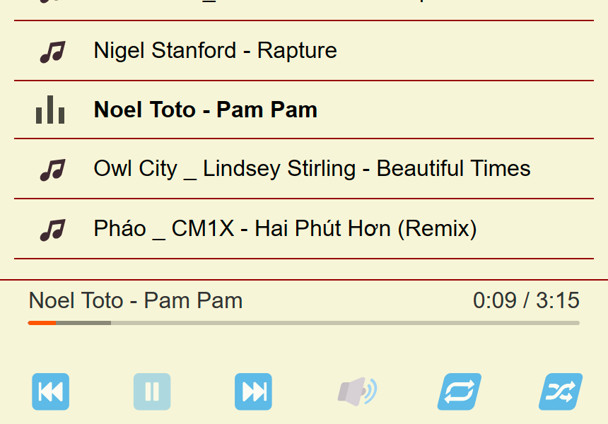

# html5-audio-player

> 已修改为获取nginx目录下音乐文件列表，并支持播放<br />列表为全屏自适应手机电脑

## [Demo](https://sogadm.github.io/html5-audio-player/)

## 效果图



## 使用方式

### 1. Nginx 配置返回 json 格式的音乐文件列表

- nginx 配置如下：

> 注意`/music/`是你的音乐目录，请根据你的实际情况修改

```
location = /music/ {
    autoindex on;
    autoindex_format json;
    autoindex_localtime on;
    autoindex_exact_size off;
}
```

- nginx 返回 json 格式的音乐文件列表，示例如下：

```json
[
  {
    "name": "Pháo _ CM1X - Hai Phút Hơn (Remix).ogg",
    "type": "file",
    "mtime": "Sat, 28 Oct 2023 05:31:05 GMT",
    "size": 7835568
  },
  {
    "name": "Really Slow Motion - Remembrance.flac",
    "type": "file",
    "mtime": "Sat, 28 Oct 2023 05:31:15 GMT",
    "size": 15570219
  }
]
```

### 2. 下载仓库文件并修改`index.html`文件内容

> 注意：请将下面代码中的`http//localhost/music/`换成你的音乐网站返回`json`的链接

```
    <script>
// test image for web notifications
var iconImage = null;

fetch('http//localhost/music/')/*将http//localhost/music/换成你的音乐网站目录*/
  .then(response => response.json())
  .then(data => {
    const playList = data.map(item => ({
      icon: iconImage,
      title: item.name.split('.')[0],
      file: `http//localhost/music/${item.name}`/*将http//localhost/music/换成你的音乐网站目录*/
    }));

    AP.init({
        container:'#player',//a string containing one CSS selector
        volume   : 1,
        autoPlay : false,
        notification: false,
        playList
    });
  })
  .catch(error => console.error('Error:', error));
    </script>
```
